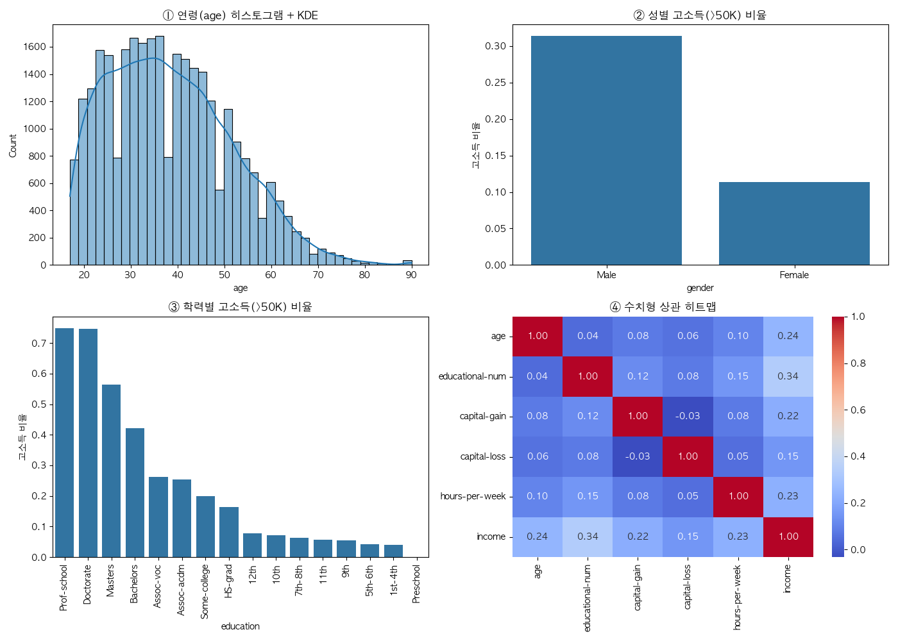

# 성인 소득(Adult Income) 데이터 분석 리포트

> 생성 시각: 2026-07-21 23:27:09 · 작성자: 광주캠퍼스 4반 길다인

## 0. 데이터 정제 요약

| 항목 | 값 |
| --- | --- |
| 원본 행 수 | 32,561 |
| 정제 후 행 수 | 30,139 |
| 결측 제거 | 2,399 |
| 중복 제거 | 23 |
| 고소득(>50K) 비율 | 24.9% |

## 1. 탐색적 분석 (EDA)

## 2. 통계 가설 검정 (CDA)

### ① t검정 — 소득집단 간 평균 연령 차이 · **유의미**

- 고소득 평균 44.0세 (n=7,506) · 저소득 평균 36.6세 (n=22,633)
- t=49.4772 · p=0
- 해석: p=0 < 0.05 → 두 그룹의 평균 age 차이가 통계적으로 유의미

### ② 카이제곱 — 성별과 소득의 연관성 · **유의미**

- chi2=1413.80 · dof=1 · p=2.104e-309
- 해석: p=2.104e-309 < 0.05 → 두 변수는 독립이 아님(연관 있음)

### ③ ANOVA — 직군(workclass)별 근로시간 차이 · **유의미**

- F=134.69 · 그룹수=7 · p=5.213e-169
- 해석: p=5.213e-169 < 0.05 → 그룹 간 평균 hours-per-week 차이가 통계적으로 유의미

## 3. 소득 예측 모델 (KNN 분류)

| 지표 | 값 |
| --- | --- |
| 정확도(accuracy) | 0.836 |
| 고소득 정밀도(precision) | 0.698 |
| 고소득 재현율(recall) | 0.604 |
| 고소득 F1 | 0.648 |
| Macro F1 | 0.770 |

**혼동행렬** (행=실제, 열=예측)

| 실제 \ 예측 | ≤50K (0) | >50K (1) |
| --- | --- | --- |
| ≤50K (0) | 4134 | 393 |
| >50K (1) | 594 | 907 |

- 학습 24,111 / 평가 6,028 · 재로딩 예측 일치 검증: OK
- 정확도 0.836이지만 고소득(>50K) 재현율은 0.604 — 불균형 데이터라 소수 클래스 포착력을 함께 봐야 한다
- 피처 — 수치형: `age, educational-num, capital-gain, capital-loss, hours-per-week` · 범주형: `workclass, marital-status, occupation, relationship, race, gender, native-country`

## 4. 학력별 고소득률 상위 10

| 학력(education) | 고소득(>50K) 비율 |
| --- | --- |
| Prof-school | 74.9% |
| Doctorate | 74.7% |
| Masters | 56.5% |
| Bachelors | 42.2% |
| Assoc-voc | 26.3% |
| Assoc-acdm | 25.4% |
| Some-college | 20.0% |
| HS-grad | 16.4% |
| 12th | 7.7% |
| 10th | 7.2% |

인터랙티브 대시보드: `income_by_education_gender.html` (outputs/ 폴더에서 열람)
